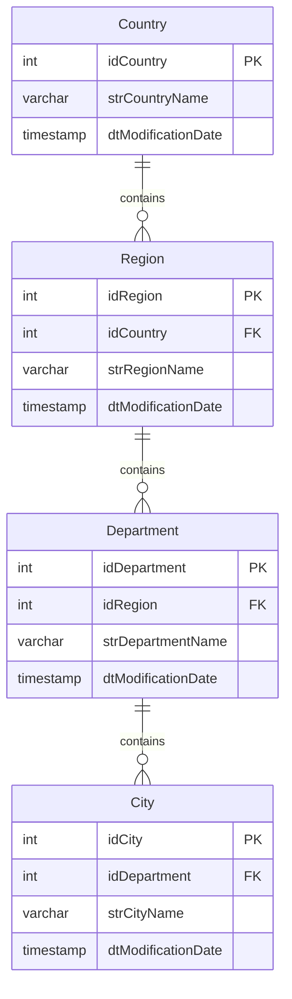
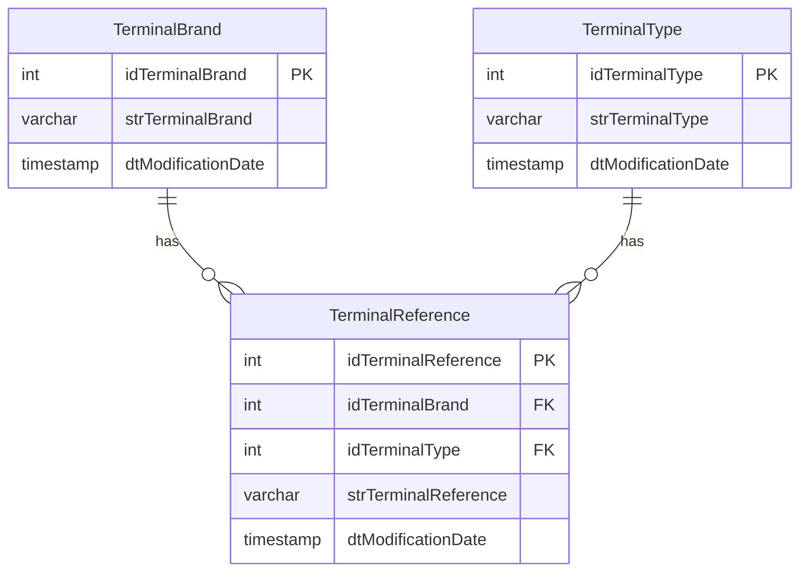
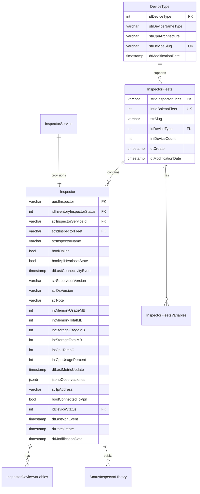
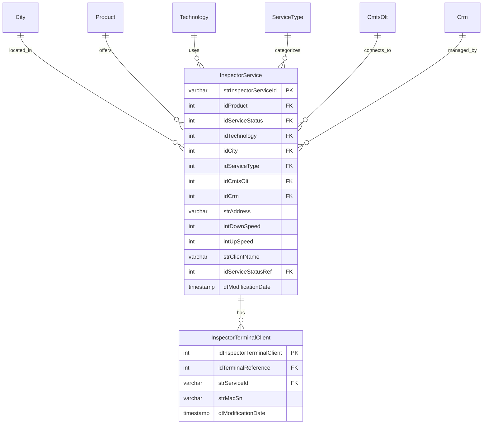
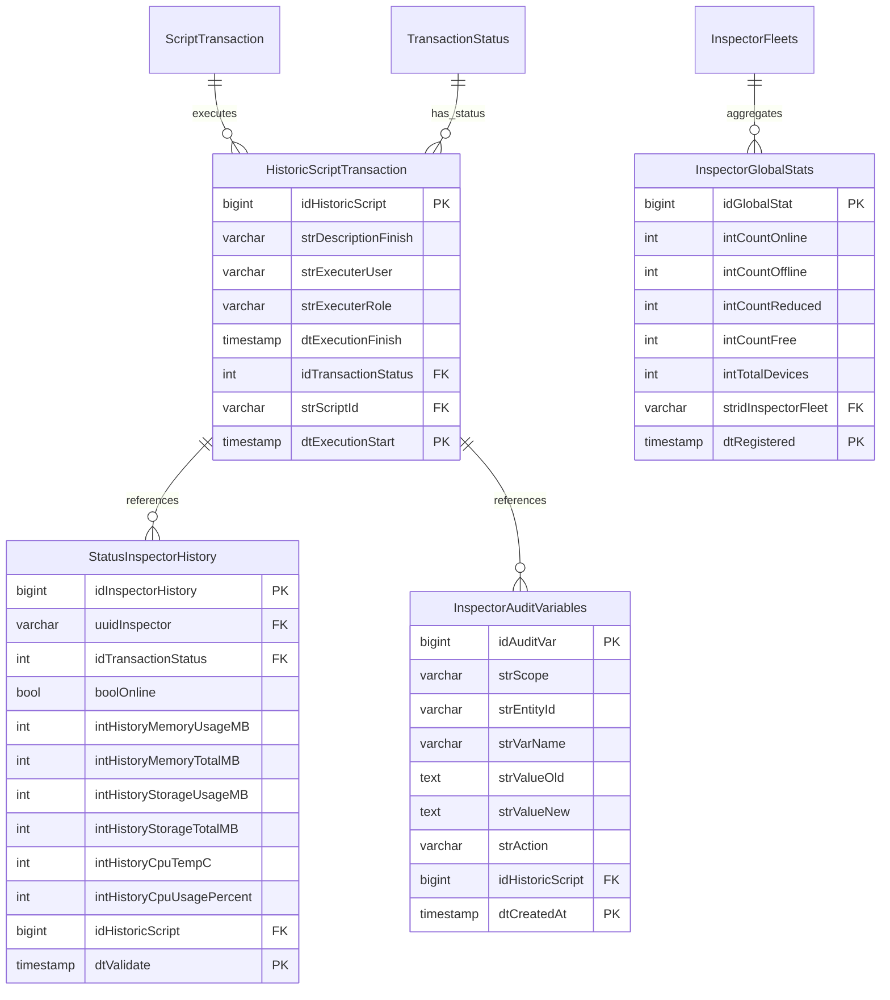

# InspectorGestion 5.0 - Design Document

> **Propósito**: Este documento describe la arquitectura técnica, decisiones de diseño, y especificaciones de implementación del sistema InspectorGestion 5.0.

---

## 1. Arquitectura del Sistema

### 1.1 Patrón Arquitectónico

El sistema sigue una **arquitectura de microservicios containerizados** con los siguientes patrones:

- **API Gateway Pattern**: KrakenD como punto de entrada único
- **Repository Pattern**: Separación de lógica de acceso a datos
- **Service Layer Pattern**: Lógica de negocio encapsulada en servicios
- **Task Queue Pattern**: Celery para procesamiento asíncrono
- **Database per Service**: PostgreSQL con esquemas separados (inspector, keycloak, wireguard)

### 1.2 Diagrama de Componentes

```
┌─────────────────────────────────────────────────────────────────┐
│                         CLIENTE (Browser)                        │
└────────────────────────────┬────────────────────────────────────┘
                             │ HTTPS
                             ↓
┌─────────────────────────────────────────────────────────────────┐
│                    FRONTEND (React + Vite)                       │
│  Port: 3001 (dev: npm start)                                    │
│  ┌──────────────────────────────────────────────────────────┐   │
│  │ Pages: Dashboard, Devices, Fleets, Settings             │   │
│  │ Components: DeviceCard, FleetCard, ActionBar            │   │
│  │ State: React Context + Local State                      │   │
│  └──────────────────────────────────────────────────────────┘   │
└────────────────────────────┬────────────────────────────────────┘
                             │ HTTP REST
                             ↓
┌─────────────────────────────────────────────────────────────────┐
│                    KRAKEND API GATEWAY                           │
│  IP: 172.16.0.11  Port: 8081                                    │
│  ┌──────────────────────────────────────────────────────────┐   │
│  │ - JWT Validation (Keycloak)                             │   │
│  │ - Rate Limiting                                          │   │
│  │ - Request Routing                                        │   │
│  │ - CORS Handling                                          │   │
│  └──────────────────────────────────────────────────────────┘   │
└────────────────────────────┬────────────────────────────────────┘
                             │
                             ↓
┌─────────────────────────────────────────────────────────────────┐
│                    BACKEND (FastAPI)                             │
│  IP: 172.16.0.2  Port: 5000                                     │
│  ┌──────────────────────────────────────────────────────────┐   │
│  │ API Layer (src/api/v1/)                                  │   │
│  │  ├─ endpoints/                                           │   │
│  │  │   ├─ health.py         (Health checks)               │   │
│  │  │   ├─ sync.py           (Manual sync triggers)        │   │
│  │  │   ├─ info_devices.py   (Device queries)              │   │
│  │  │   ├─ device_admin.py   (Device actions)              │   │
│  │  │   ├─ fleets.py         (Fleet management)            │   │
│  │  │   ├─ configuration.py  (Variables)                   │   │
│  │  │   ├─ catalogs.py       (Lookup tables)               │   │
│  │  │   └─ history.py        (Reports)                     │   │
│  │  └─ schemas/                                            │   │
│  │      ├─ device_action_schema.py                         │   │
│  │      ├─ fleet_schema.py                                 │   │
│  │      ├─ variable_schema.py                              │   │
│  │      └─ provisioning_schema.py                          │   │
│  └──────────────────────────────────────────────────────────┘   │
│  ┌──────────────────────────────────────────────────────────┐   │
│  │ Service Layer (src/services/)                            │   │
│  │  ├─ balena_service.py    (Balena CLI wrapper)           │   │
│  │  ├─ inventory_sync.py    (Sync orchestration)           │   │
│  │  ├─ configuration_sync.py (Variable sync)               │   │
│  │  ├─ device_admin_service.py (Device operations)         │   │
│  │  ├─ fleet_admin_service.py (Fleet operations)           │   │
│  │  ├─ info_devices_service.py (Device queries)            │   │
│  │  └─ catalogs_service.py  (Catalog queries)              │   │
│  └──────────────────────────────────────────────────────────┘   │
│  ┌──────────────────────────────────────────────────────────┐   │
│  │ Repository Layer (src/repositories/)                     │   │
│  │  ├─ fleet_repo.py                                       │   │
│  │  ├─ info_devices_repo.py                                │   │
│  │  ├─ device_vars_repo.py                                 │   │
│  │  ├─ fleet_vars_repo.py                                  │   │
│  │  ├─ history_repo.py                                     │   │
│  │  ├─ provisioning_repo.py                                │   │
│  │  └─ catalogs_repo.py                                    │   │
│  └──────────────────────────────────────────────────────────┘   │
│  ┌──────────────────────────────────────────────────────────┐   │
│  │ Utilities (src/utils/)                                   │   │
│  │  ├─ transaction_manager.py (Audit transactions)         │   │
│  │  └─ deviceStatus.py (Status calculation)                │   │
│  └──────────────────────────────────────────────────────────┘   │
└────────────────────────────┬────────────────────────────────────┘
                             │
        ┌────────────────────┴────────────────────┐
        ↓                                         ↓
┌──────────────────┐                    ┌──────────────────┐
│   POSTGRESQL     │                    │      REDIS       │
│ 172.16.0.8:5432  │                    │  172.16.0.6:6379 │
│                  │                    │                  │
│ ┌──────────────┐ │                    │ ┌──────────────┐ │
│ │ inspector DB │ │                    │ │ Celery Broker│ │
│ │ keycloak DB  │ │                    │ │ Cache        │ │
│ │ wireguard DB │ │                    │ └──────────────┘ │
│ └──────────────┘ │                    └──────────────────┘
└──────────────────┘                             ↑
        ↑                                        │
        │                                        │
┌───────┴────────────────────────────────────────┴────────────┐
│                   CELERY WORKERS                             │
│  IP: 172.16.0.14 (worker), 172.16.0.15 (beat)               │
│  ┌──────────────────────────────────────────────────────┐   │
│  │ src/worker/tasks.py                                  │   │
│  │  ├─ task_run_automatic_sync (Scheduled: 5:00 AM)    │   │
│  │  ├─ task_run_configuration_sync                     │   │
│  │  ├─ task_restart_single_device                      │   │
│  │  ├─ task_restart_bulk_devices                       │   │
│  │  └─ task_run_automatic_restart                      │   │
│  └──────────────────────────────────────────────────────┘   │
└─────────────────────────┬────────────────────────────────────┘
                          │
                          ↓
                  ┌──────────────┐
                  │ BALENA CLOUD │
                  │ (External)   │
                  └──────────────┘
```

---

## 2. Modelo de Datos

### 2.1 Esquema de Base de Datos

#### 2.1.1 Jerarquía Geográfica



#### 2.1.2 Catálogos de Terminales



#### 2.1.3 Modelo de Dispositivos y Flotas



#### 2.1.4 Modelo de Servicios



#### 2.1.5 Tablas Particionadas (Históricos)



### 2.2 Estrategia de Particionamiento

| Tabla | Columna de Partición | Intervalo | Retención | Premake |
|-------|---------------------|-----------|-----------|---------|
| `HistoricScriptTransaction` | `dtExecutionStart` | 1 día | 1 mes | 7 particiones |
| `StatusInspectorHistory` | `dtValidate` | 1 día | 1 mes | 7 particiones |
| `InspectorAuditVariables` | `dtCreatedAt` | 1 mes | 6 meses | 3 particiones |
| `InspectorGlobalStats` | `dtRegistered` | 1 mes | 1 año | 3 particiones |

**Gestión Automática**: `pg_partman` crea y elimina particiones automáticamente.

### 2.3 Índices Principales

```sql
-- Índices de búsqueda frecuente
CREATE INDEX idx_inspector_fleet ON Inspector (stridInspectorFleet);
CREATE INDEX idx_inspector_service ON Inspector (strInspectorServiceId);
CREATE INDEX idx_inspector_online ON Inspector (boolOnline);

-- Índices de auditoría
CREATE INDEX idx_audit_entity ON InspectorAuditVariables (strEntityId, strScope);
CREATE INDEX idx_audit_varname ON InspectorAuditVariables (strVarName);

-- Índices de histórico
CREATE INDEX idx_history_uuid ON StatusInspectorHistory (uuidInspector);
CREATE INDEX idx_history_date ON StatusInspectorHistory (dtValidate DESC);
```

---

## 3. Arquitectura de API

### 3.1 Estructura de Endpoints

**Base URL**: `/api/v1`

| Endpoint | Métodos | Descripción |
|----------|---------|-------------|
| `/health` | GET | Health checks del sistema |
| `/sync/inventory` | POST | Sincronización manual de inventario |
| `/sync/configuration` | POST | Sincronización manual de variables |
| `/infodevices` | GET | Listado de dispositivos |
| `/infodevices/{uuid}` | GET | Detalle de dispositivo |
| `/admin/device/{uuid}/restart` | POST | Reiniciar aplicación |
| `/admin/device/{uuid}/reboot` | POST | Reiniciar sistema operativo |
| `/admin/device/{uuid}/shutdown` | POST | Apagar dispositivo |
| `/admin/device/{uuid}/move` | POST | Mover a otra flota |
| `/admin/device/{uuid}/provision` | POST | Provisionar dispositivo |
| `/admin/device/{uuid}/note` | PUT | Actualizar nota |
| `/admin/device/{uuid}` | DELETE | Eliminar dispositivo |
| `/fleets` | GET, POST | Listar/crear flotas |
| `/fleets/{id}` | GET, PUT, DELETE | Detalle/modificar/eliminar flota |
| `/fleets/{id}/devices` | GET | Dispositivos de flota |
| `/configuration/fleet/{id}/vars` | GET, POST | Variables de flota |
| `/configuration/fleet/{id}/vars/{key}` | PUT, DELETE | Modificar/eliminar variable |
| `/configuration/device/{uuid}/vars` | GET, POST | Variables de dispositivo |
| `/configuration/device/{uuid}/vars/{key}` | PUT, DELETE | Modificar/eliminar variable |
| `/catalogs/{type}` | GET | Catálogos (countries, cities, etc.) |
| `/history/devices/{uuid}` | GET | Histórico de dispositivo |
| `/history/transactions` | GET | Histórico de transacciones |

### 3.2 Esquemas de Request/Response

#### 3.2.1 Device Action Request

```python
class DeviceActionRequest(BaseModel):
    action: Literal["restart", "reboot", "shutdown"]
    user: str
    role: str
```

#### 3.2.2 Provisioning Request

```python
class ProvisioningRequest(BaseModel):
    strInspectorServiceId: str
    idCity: int
    idProduct: int
    idServiceStatus: int
    idTechnology: int
    idServiceType: int
    idCmtsOlt: int
    idCrm: int
    strAddress: str
    intDownSpeed: int
    intUpSpeed: int
    strClientName: str
    strMacSn: str
    idTerminalReference: int
```

#### 3.2.3 Fleet Create Request

```python
class FleetCreateRequest(BaseModel):
    name: str
    device_type: str  # Slug de DeviceType
    organization: Optional[str] = None
```

#### 3.2.4 Variable Request

```python
class VariableRequest(BaseModel):
    key: str
    value: str
```

### 3.3 Códigos de Respuesta HTTP

| Código | Significado | Uso |
|--------|-------------|-----|
| 200 | OK | Operación exitosa |
| 201 | Created | Recurso creado exitosamente |
| 202 | Accepted | Tarea asíncrona aceptada (Celery) |
| 400 | Bad Request | Datos de entrada inválidos |
| 401 | Unauthorized | Token JWT inválido o ausente |
| 403 | Forbidden | Usuario sin permisos |
| 404 | Not Found | Recurso no encontrado |
| 409 | Conflict | Conflicto (ej: flota ya existe) |
| 500 | Internal Server Error | Error del servidor |
| 503 | Service Unavailable | Servicio externo no disponible |

---

## 4. Integración con Balena Cloud

### 4.1 Balena CLI Wrapper (`BalenaService`)

**Estrategia**: Ejecutar comandos Balena CLI mediante `subprocess` y parsear salida JSON.

#### 4.1.1 Métodos Principales

| Método | Comando Balena | Descripción |
|--------|----------------|-------------|
| `login()` | `balena login --token <token>` | Autenticación |
| `get_fleets()` | `balena fleets --json` | Listar flotas |
| `get_devices_by_fleet(slug)` | `balena devices --fleet <slug> --json` | Dispositivos de flota |
| `get_device_detail(uuid)` | `balena device <uuid> --json` | Métricas de dispositivo |
| `get_fleet_vars(slug)` | `balena envs --fleet <slug> --json` | Variables de flota |
| `get_device_vars(uuid)` | `balena envs --device <uuid> --json` | Variables de dispositivo |
| `set_fleet_variable(slug, key, value)` | `balena env add <key> <value> --fleet <slug>` | Crear/actualizar variable |
| `remove_fleet_variable(slug, key)` | `balena env rm <id> --yes` | Eliminar variable |
| `restart_device(uuid)` | `balena device restart <uuid>` | Reiniciar aplicación |
| `reboot_device(uuid)` | `balena device reboot <uuid>` | Reiniciar OS |
| `shutdown_device(uuid)` | `balena device shutdown <uuid>` | Apagar dispositivo |
| `move_device(uuid, target)` | `balena device move <uuid> --fleet <target>` | Mover flota |
| `remove_device(uuid)` | `balena device rm <uuid> --yes` | Eliminar dispositivo |

#### 4.1.2 Manejo de Errores

```python
try:
    result = subprocess.run(
        ["balena", "device", uuid, "--json"],
        capture_output=True,
        text=True,
        timeout=30,
        check=True
    )
    return json.loads(result.stdout)
except subprocess.TimeoutExpired:
    logger.error(f"Timeout ejecutando comando Balena")
    raise
except subprocess.CalledProcessError as e:
    logger.error(f"Error Balena CLI: {e.stderr}")
    raise
except json.JSONDecodeError:
    logger.error(f"Respuesta Balena no es JSON válido")
    raise
```

### 4.2 Autenticación

**Token API**: Almacenado en variable de entorno `BALENA_API_TOKEN`.

**Login Automático**: Ejecutado al iniciar el servicio mediante `BalenaService.login()`.

---

## 5. Gestión de Transacciones y Auditoría

### 5.1 Transaction Manager

**Responsabilidad**: Registrar inicio y fin de todas las operaciones del sistema.

#### 5.1.1 Script IDs (Enum)

```python
class ScriptIds:
    # Sincronización
    INVENTORY_SYNC_AUTO = "INVENTORY_SYNC_AUTO"
    INVENTORY_SYNC_MANUAL = "INVENTORY_SYNC_MANUAL"
    CONFIG_SYNC_AUTO = "CONFIG_SYNC_AUTO"
    CONFIG_SYNC_MANUAL = "CONFIG_SYNC_MANUAL"
    
    # Acciones de dispositivos
    MANUAL_RESTART = "MANUAL_RESTART"
    MANUAL_REBOOT = "MANUAL_REBOOT"
    MANUAL_SHUTDOWN = "MANUAL_SHUTDOWN"
    AUTO_RESTART = "AUTO_RESTART"
    
    # Administración
    MANUAL_DEVICE_MOVE = "MANUAL_DEVICE_MOVE"
    MANUAL_DEVICE_DELETE = "MANUAL_DEVICE_DELETE"
    MANUAL_DEVICE_NOTE = "MANUAL_DEVICE_NOTE"
    MANUAL_PROVISIONING = "MANUAL_PROVISIONING"
    
    # Flotas
    MANUAL_FLEET_CREATE = "MANUAL_FLEET_CREATE"
    MANUAL_FLEET_RENAME = "MANUAL_FLEET_RENAME"
    MANUAL_FLEET_DELETE = "MANUAL_FLEET_DELETE"
    
    # Variables
    MANUAL_VAR_CREATE = "MANUAL_VAR_CREATE"
    MANUAL_VAR_UPDATE = "MANUAL_VAR_UPDATE"
    MANUAL_VAR_DELETE = "MANUAL_VAR_DELETE"
```

#### 5.1.2 Flujo de Transacción

```python
# 1. Iniciar transacción
historic_id = await TransactionManager.start_transaction(
    script_id=ScriptIds.MANUAL_RESTART,
    user="admin@example.com",
    role="Administrador"
)

try:
    # 2. Ejecutar operación
    result = await BalenaService.restart_device(uuid)
    
    # 3. Finalizar con éxito
    await TransactionManager.finish_transaction(
        historic_id=historic_id,
        script_id=ScriptIds.MANUAL_RESTART,
        status=TransactionStatus.COMPLETO,
        description=f"Dispositivo {uuid} reiniciado exitosamente"
    )
except Exception as e:
    # 4. Finalizar con error
    await TransactionManager.finish_transaction(
        historic_id=historic_id,
        script_id=ScriptIds.MANUAL_RESTART,
        status=TransactionStatus.FALLIDO,
        description=f"Error: {str(e)}"
    )
    raise
```

### 5.2 Auditoría de Variables

**Tabla**: `InspectorAuditVariables`

**Trigger**: Automático en cada operación de variables.

```python
await HistoryRepository.insert_variable_audit(
    scope="DEVICE",  # o "FLEET"
    entity_id=uuid,
    var_name="MY_VAR",
    value_old="old_value",
    value_new="new_value",
    action="UPDATE",  # CREATE, UPDATE, DELETE
    historic_id=historic_id
)
```

---

## 6. Procesamiento Asíncrono con Celery

### 6.1 Configuración

**Broker**: Redis (`redis://172.16.0.6:6379/0`)

**Backend**: Redis (para almacenar resultados)

**Concurrency**: 4 workers (configurable)

### 6.2 Tareas Programadas (Celery Beat)

```python
from celery.schedules import crontab

celery_app.conf.beat_schedule = {
    'sync-inventory-daily': {
        'task': 'tasks.run_automatic_sync',
        'schedule': crontab(hour=5, minute=0),  # 5:00 AM
    },
    'sync-config-daily': {
        'task': 'tasks.run_configuration_sync',
        'schedule': crontab(hour=5, minute=30),  # 5:30 AM
    },
}
```

### 6.3 Monitoreo de Tareas

**Estado de Tarea Celery**:

- `PENDING`: Encolada
- `STARTED`: En ejecución
- `SUCCESS`: Completada exitosamente
- `FAILURE`: Falló
- `RETRY`: Reintentando

**Consulta de Estado**:

```python
from celery.result import AsyncResult

task = AsyncResult(task_id)
status = task.state
result = task.result  # Solo si SUCCESS
```

**Frontend Polling**:

```typescript
const pollTaskStatus = async (taskId: string) => {
    const interval = setInterval(async () => {
        const response = await fetch(`/api/v1/admin/task/${taskId}`);
        const data = await response.json();
        
        if (data.state === 'SUCCESS' || data.state === 'FAILURE') {
            clearInterval(interval);
            // Actualizar UI
        }
    }, 2000);  // Cada 2 segundos
};
```

---

## 7. Seguridad

### 7.1 Autenticación y Autorización

#### 7.1.1 Flujo de Autenticación

```
1. Usuario → Frontend: Ingresa credenciales
2. Frontend → KrakenD: POST /auth/login (sin redirección)
3. KrakenD → Keycloak: Intercambio de credenciales por Token (OIDC)
4. Keycloak → KrakenD: Retorna Access Token + Refresh Token
5. KrakenD → Frontend: Retorna 200 OK + **Set-Cookie: SESSION_ID (HttpOnly, Secure)**
6. Frontend → KrakenD: Petición API con Cookie (automática)
7. KrakenD: Extracción de Token de Cookie + Validación Local (JWKS Cache)
8. KrakenD → Backend: Enruta petición con header `Authorization: Bearer <Token>`
9. Backend → Frontend: Retorna respuesta JSON
```

#### 7.1.2 Estructura del Token JWT

```json
{
  "exp": 1706400000,
  "iat": 1706313600,
  "sub": "user-uuid",
  "preferred_username": "admin@example.com",
  "realm_access": {
    "roles": ["Administrador", "Operador"]
  },
  "resource_access": {
    "inspector-app": {
      "roles": ["admin"]
    }
  }
}
```

#### 7.1.3 Matriz de Roles y Permisos

| Acción | Administrador | Operador | Auditor |
|--------|---------------|----------|---------|
| Ver dispositivos | ✅ | ✅ | ✅ |
| Ver flotas | ✅ | ✅ | ✅ |
| Reiniciar dispositivo | ✅ | ✅ | ❌ |
| Apagar dispositivo | ✅ | ❌ | ❌ |
| Crear/eliminar flota | ✅ | ❌ | ❌ |
| Gestionar variables | ✅ | ✅ | ❌ |
| Provisionar dispositivo | ✅ | ✅ | ❌ |
| Ver históricos | ✅ | ✅ | ✅ |
| Gestionar VPN | ✅ | ❌ | ❌ |

### 7.2 Validación en Backend

```python
from src.core.security import get_current_user, require_role

@router.post("/device/{uuid}/shutdown")
async def shutdown_device(
    uuid: str,
    current_user: dict = Depends(get_current_user),
    _: None = Depends(require_role("Administrador"))
):
    # Solo Administradores pueden apagar dispositivos
    ...
```

### 7.3 Seguridad de Datos

- **Passwords**: Nunca almacenados (delegado a Keycloak)
- **Tokens (Frontend)**: Almacenados en **Cookies HttpOnly, Secure, SameSite=Strict** (No LocalStorage)
- **API Tokens (Backend)**: Almacenados en variables de entorno
- **Datos Sensibles**: No se almacenan datos de tarjetas de crédito ni información financiera
- **Logs**: No se registran credenciales ni tokens completos

---

## 8. Despliegue

### 8.1 Docker Compose

**Archivo**: `docker-compose.yml`

**Red**: `InspecNet` (172.16.0.0/27)

**Volúmenes Persistentes**:

- `pgdata`: Datos de PostgreSQL
- `redis_data`: Datos de Redis
- `./wireguard_data`: Configuración de WireGuard
- `./backend_logs`: Logs del backend

### 8.2 Variables de Entorno

**Archivo**: `.env` (raíz del proyecto)

```bash
# Timezone
TZ=America/Bogota

# PostgreSQL
POSTGRES_USER=postgres
POSTGRES_PASSWORD=<secret>
POSTGRES_DB=inspector_db

# Redis
REDIS_PASSWORD=<secret>

# Keycloak
KEYCLOAK_USER=admin
KEYCLOAK_PASSWORD=<secret>

# Balena
BALENA_API_TOKEN=<token>

# WireGuard
WG_HOST=<public-ip>
WG_EASY_PASSWORD=<secret>
WG_DEFAULT_ADDRESS=10.8.0.x
WG_DEFAULT_DNS=1.1.1.1

# Celery
CELERY_WORKER_CONCURRENCY=4
```

### 8.3 Healthchecks

```yaml
healthcheck:
  test: ["CMD-SHELL", "pg_isready -U ${POSTGRES_USER} -d ${POSTGRES_DB}"]
  interval: 10s
  timeout: 5s
  retries: 5
```

---

## 9. Consideraciones de Diseño

### 9.1 Decisiones Técnicas

| Decisión | Justificación |
|----------|---------------|
| **Balena CLI vs SDK** | CLI más estable y documentado; SDK en Python tiene limitaciones |
| **Subprocess vs HTTP** | Balena CLI retorna JSON estructurado; más fácil de parsear |
| **PostgreSQL Partitioning** | Optimiza consultas históricas y facilita eliminación de datos antiguos |
| **Celery vs Threading** | Celery permite monitoreo, reintentos y distribución de carga |
| **Repository Pattern** | Facilita testing y cambio de ORM en el futuro |
| **KrakenD vs NGINX** | KrakenD tiene JWT validation nativo y mejor performance |

### 9.2 Limitaciones Conocidas

1. **Balena CLI Timeout**: Comandos pueden tardar hasta 5 minutos (reboot/shutdown)
2. **Concurrencia Limitada**: Solo 5 dispositivos simultáneos en sincronización
3. **Sin Caché de Inventario**: Cada consulta va a BD (considerar Redis cache)
4. **Logs No Centralizados**: Cada contenedor tiene sus propios logs
5. **Sin Monitoreo de Métricas**: No hay Prometheus/Grafana configurado

### 9.3 Mejoras Futuras

- [ ] Implementar caché de Redis para consultas frecuentes
- [ ] Agregar Prometheus + Grafana para monitoreo
- [ ] Implementar WebSockets para actualizaciones en tiempo real
- [ ] Agregar tests unitarios y de integración
- [ ] Implementar CI/CD con GitHub Actions
- [ ] Agregar soporte para múltiples organizaciones Balena
- [ ] Implementar backup automático de PostgreSQL

---

## 10. Diagramas de Secuencia

### 10.1 Sincronización de Inventario

```
Celery Beat → Celery Worker: Dispara task_run_automatic_sync (5:00 AM)
Celery Worker → TransactionManager: start_transaction(INVENTORY_SYNC_AUTO)
TransactionManager → PostgreSQL: INSERT INTO HistoricScriptTransaction
Celery Worker → InventorySyncService: sync_all()
InventorySyncService → BalenaService: get_fleets()
BalenaService → Balena Cloud: balena fleets --json
Balena Cloud → BalenaService: [fleets array]
InventorySyncService → FleetRepository: upsert_fleet(fleet_data)
FleetRepository → PostgreSQL: INSERT/UPDATE InspectorFleets

loop Para cada flota
    InventorySyncService → BalenaService: get_devices_by_fleet(slug)
    BalenaService → Balena Cloud: balena devices --fleet <slug> --json
    Balena Cloud → BalenaService: [devices array]
    
    loop Para cada dispositivo (max 5 concurrentes)
        InventorySyncService → BalenaService: get_device_detail(uuid)
        BalenaService → Balena Cloud: balena device <uuid> --json
        Balena Cloud → BalenaService: {device metrics}
        InventorySyncService → InfoDevicesRepository: upsert_device(device_data)
        InfoDevicesRepository → PostgreSQL: INSERT/UPDATE Inspector
        InventorySyncService → HistoryRepository: insert_device_status()
        HistoryRepository → PostgreSQL: INSERT INTO StatusInspectorHistory
    end
    
    InventorySyncService → FleetRepository: update_fleet_stats(fleet_id)
    FleetRepository → PostgreSQL: INSERT INTO InspectorGlobalStats
end

InventorySyncService → TransactionManager: finish_transaction(COMPLETO)
TransactionManager → PostgreSQL: UPDATE HistoricScriptTransaction
```

### 10.2 Reinicio de Dispositivo

```
Usuario → Frontend: Click "Reiniciar"
Frontend → KrakenD: POST /api/v1/admin/device/{uuid}/restart
KrakenD → Keycloak: Validar JWT
Keycloak → KrakenD: Token válido
KrakenD → Backend: Enrutar petición
Backend → DeviceAdminService: execute_power_action(uuid, "restart")
DeviceAdminService → Celery: task_restart_single_device.delay(uuid)
Celery → Frontend: {task_id: "abc123"}
Frontend → Usuario: "Reinicio en progreso..."

Celery Worker → TransactionManager: start_transaction(MANUAL_RESTART)
Celery Worker → DeviceAdminService: monitor_power_action(uuid, "restart")
DeviceAdminService → BalenaService: restart_device(uuid)
BalenaService → Balena Cloud: balena device restart <uuid>
Balena Cloud → Dispositivo: Enviar comando
Dispositivo → Balena Cloud: Reiniciando...
Balena Cloud → BalenaService: Comando completado
BalenaService → DeviceAdminService: Success
DeviceAdminService → Celery Worker: {status: "completed"}
Celery Worker → TransactionManager: finish_transaction(COMPLETO)

Frontend → Backend: GET /api/v1/admin/task/abc123 (polling cada 2s)
Backend → Celery: AsyncResult(abc123).state
Celery → Backend: "SUCCESS"
Backend → Frontend: {state: "SUCCESS", result: {...}}
Frontend → Usuario: "Reinicio completado ✅"
```

---

## 11. Patrones de Código

### 11.1 Repository Pattern

```python
class BaseRepository:
    @staticmethod
    async def execute_query(query: str, params: dict = None):
        async with PostgresConnector.get_connection() as conn:
            return await conn.fetch(query, *params.values())

class InfoDevicesRepository(BaseRepository):
    @staticmethod
    async def get_device_by_uuid(uuid: str):
        query = "SELECT * FROM inspector.Inspector WHERE uuidInspector = $1"
        result = await InfoDevicesRepository.execute_query(query, {"uuid": uuid})
        return dict(result[0]) if result else None
```

### 11.2 Service Pattern

```python
class DeviceAdminService:
    @classmethod
    async def execute_power_action(cls, uuid: str, action: str, user: str, role: str):
        # 1. Validar dispositivo existe
        device = await InfoDevicesRepository.get_device_by_uuid(uuid)
        if not device:
            raise ValueError("Dispositivo no encontrado")
        
        # 2. Iniciar transacción
        historic_id = await TransactionManager.start_transaction(
            script_id=cls.SCRIPT_MAP[action],
            user=user,
            role=role
        )
        
        try:
            # 3. Ejecutar acción
            if action == "restart":
                BalenaService.restart_device(uuid)
            elif action == "reboot":
                BalenaService.reboot_device(uuid)
            elif action == "shutdown":
                BalenaService.shutdown_device(uuid)
            
            # 4. Finalizar con éxito
            await TransactionManager.finish_transaction(
                historic_id, cls.SCRIPT_MAP[action], 
                TransactionStatus.COMPLETO, 
                f"{action} completado"
            )
        except Exception as e:
            # 5. Finalizar con error
            await TransactionManager.finish_transaction(
                historic_id, cls.SCRIPT_MAP[action], 
                TransactionStatus.FALLIDO, 
                str(e)
            )
            raise
```

---

## 12. Testing Strategy (Propuesta)

### 12.1 Tests Unitarios

- Repositories: Mockear conexión a BD
- Services: Mockear Balena CLI y Repositories
- Utilities: Tests de funciones puras

### 12.2 Tests de Integración

- API Endpoints: Tests con TestClient de FastAPI
- Celery Tasks: Tests con Celery test runner
- Database: Tests con BD de prueba

### 12.3 Tests End-to-End

- Flujos completos con Playwright/Selenium
- Validación de UI + Backend + BD

---

## 13. Glosario Técnico

| Término | Definición |
|---------|------------|
| **Upsert** | Operación que inserta si no existe, actualiza si existe |
| **Semaphore** | Mecanismo de control de concurrencia (límite de tareas simultáneas) |
| **Partitioning** | División de tabla en sub-tablas por rango de valores |
| **JWKS** | JSON Web Key Set (claves públicas para validar JWT) |
| **Slug** | Identificador amigable en formato `org/name` |
| **Heartbeat** | Señal periódica que indica que un servicio está vivo |
| **Polling** | Consulta periódica de estado (alternativa a WebSockets) |
