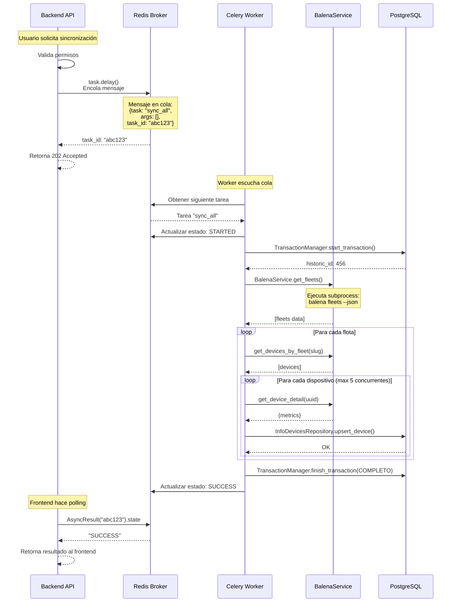
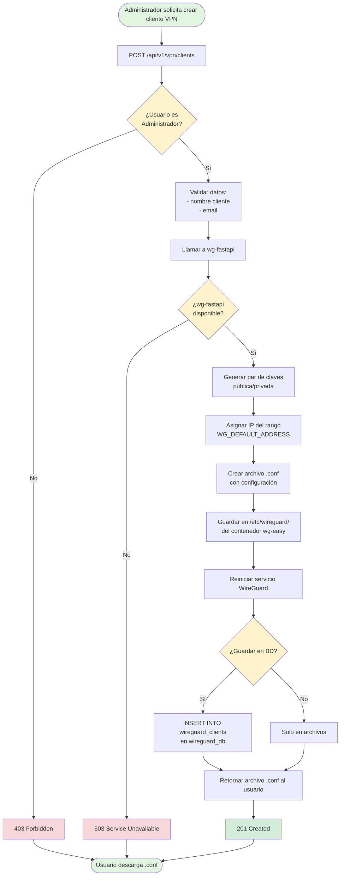
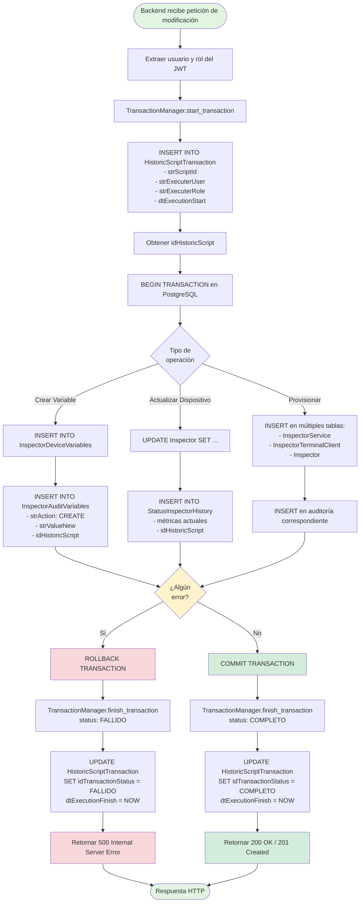
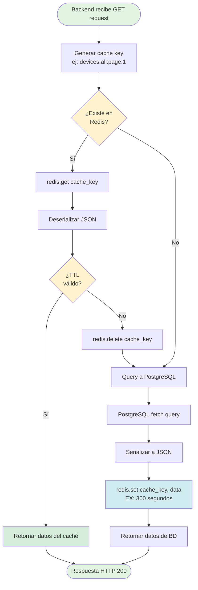
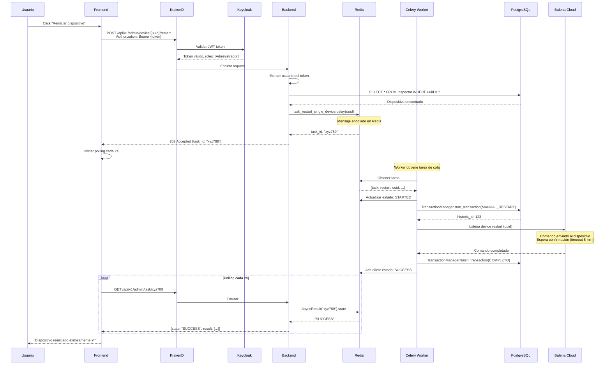
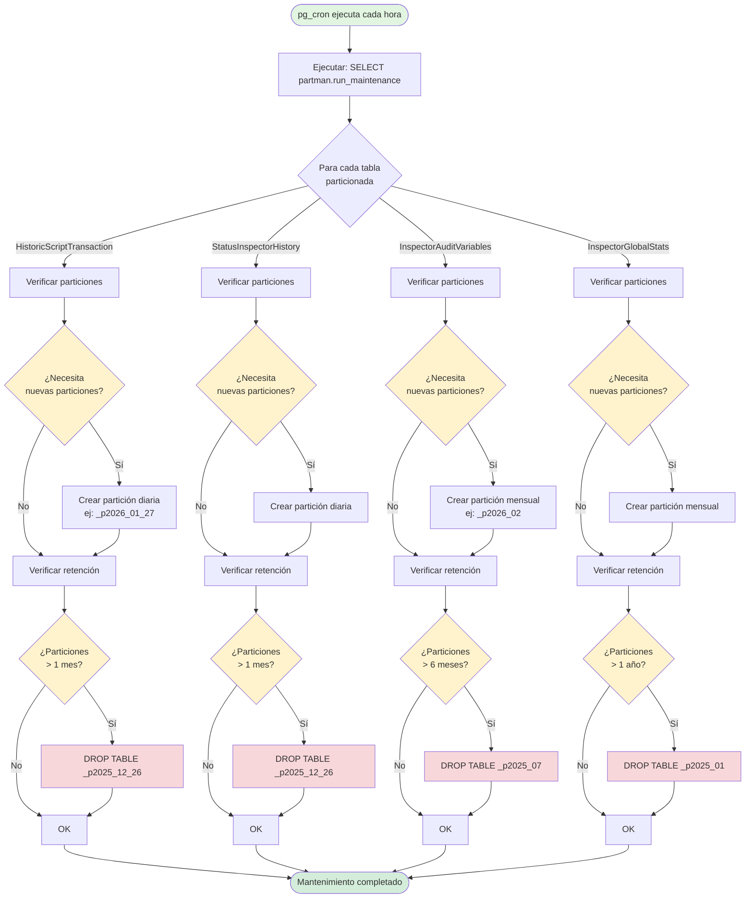
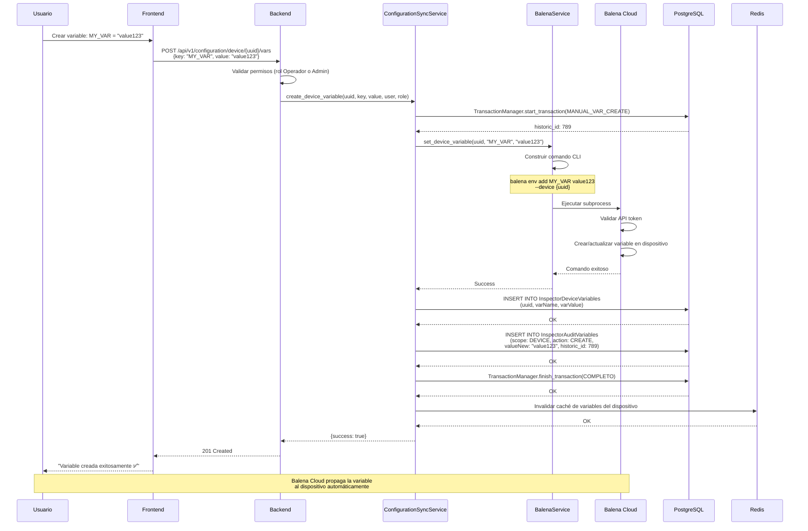

# InspectorGestion 5.0 - Diagramas de Flujo Técnicos

> **Propósito**: Diagramas de flujo detallados de las interacciones técnicas del backend con PostgreSQL, Redis, Celery, WireGuard y otros servicios.

---

## 1. Flujo de Autenticación Segura (HttpOnly Cookies + JWKS)

```mermaid
sequenceDiagram
    participant U as Usuario
    participant F as Frontend
    participant K as KrakenD Gateway
    participant KC as Keycloak
    participant B as Backend FastAPI
    participant PG as PostgreSQL
    
    %% INICIO DE SESIÓN
    U->>F: Ingresa credenciales
    F->>K: POST /auth/login (Credenciales)
    K->>KC: Intercambio OpenID Connect
    KC->>PG: Valida credenciales
    PG-->>KC: OK
    KC-->>K: Retorna Tokens (Access + Refresh)
    
    Note over K: TRANSFORMACIÓN DE SEGURIDAD:<br/>Krakend oculta los tokens reales
    
    K-->>F: 200 OK + Set-Cookie: SESSION_ID=...<br/>HttpOnly; Secure; SameSite=Strict
    
    Note over F: El Frontend NO recibe el JWT.<br/>Solo tiene una cookie opaca inaccesible para JS.<br/>¡Inmune a XSS!
    
    %% PETICIÓN CON COOKIE
    U->>F: Accede al Dashboard
    F->>K: GET /api/v1/infodevices<br/>Cookie: SESSION_ID=...
    
    Note over K: KrakenD valida firma localmente (JWKS)
    K->>K: 1. Extrae JWT de la Cookie/Session
    K->>K: 2. Verifica firma con clave pública en CACHÉ
    K->>K: 3. ¿Expirado? (Sin llamar a Keycloak)
    
    K->>B: Enruta petición + Header Authorization: Bearer {JWT}
    
    B->>B: Backend recibe JWT estándar
    B->>PG: SELECT * FROM Inspector
    PG-->>B: Datos
    B-->>F: 200 OK (Datos JSON)
```

---

## 2. Flujo de Validación KrakenD (Zero-Latency)

```mermaid
flowchart TD
    Start([Petición entrante]) --> HasCookie{¿Tiene Cookie<br/>HttpOnly?}
    
    HasCookie -->|No| Unauth[Retornar 401]
    HasCookie -->|Sí| Extract[KrakenD extrae el token JWT]
    
    Extract --> CheckCache{¿Claves JWKS<br/>en Caché?}
    
    CheckCache -->|No| DownloadJWKS[Descargar llaves públicas<br/>desde Keycloak (1 vez/hora)]
    DownloadJWKS --> SaveCache[Guardar en Memoria KrakenD]
    
    CheckCache -->|Sí| ValidateLocal[Validación Criptográfica Local<br/>(CPU bound, no Network IO)]
    SaveCache --> ValidateLocal
    
    ValidateLocal --> IsValid{¿Firma Válida?}
    
    IsValid -->|No| Reject[Rechazar Petición - 401]
    
    IsValid -->|Sí| InjectHeader[Inyectar Header Authorization<br/>para el Backend]
    InjectHeader --> PassToBackend[Pasar al Microservicio]
    
    style Start fill:#e1f5e1
    style PassToBackend fill:#d4edda
    style ValidateLocal fill:#fff3cd
    style DownloadJWKS fill:#ffe6cc
    style SaveCache fill:#d1ecf1
```

---

## 3. Flujo de Tareas Celery (Backend → Redis → Celery Worker)



---

## 4. Flujo de Conexión a WireGuard VPN



---

## 5. Flujo de Escritura en PostgreSQL con Auditoría



---

## 6. Flujo de Lectura de Caché Redis



---

## 7. Flujo Completo: Reinicio de Dispositivo con Todos los Servicios



---

## 8. Flujo de Sincronización Automática (Celery Beat)

```mermaid
flowchart TD
    Start([Celery Beat Scheduler]) --> CheckTime{¿Es 5:00 AM?}
    CheckTime -->|No| Sleep[Esperar 1 minuto]
    Sleep --> CheckTime
    
    CheckTime -->|Sí| Trigger[Disparar task_run_automatic_sync]
    Trigger --> Enqueue[Redis: Encolar tarea]
    
    Enqueue --> WorkerPick[Celery Worker obtiene tarea]
    WorkerPick --> StartAudit[PostgreSQL: start_transaction<br/>INVENTORY_SYNC_AUTO]
    
    StartAudit --> GetFleets[BalenaService.get_fleets]
    GetFleets --> SubprocessFleets[subprocess: balena fleets --json]
    
    SubprocessFleets --> ParseFleets[Parsear JSON de flotas]
    ParseFleets --> LoopFleets{Para cada<br/>flota}
    
    LoopFleets -->|Siguiente| UpsertFleet[PostgreSQL: upsert_fleet]
    UpsertFleet --> GetDevices[BalenaService.get_devices_by_fleet]
    GetDevices --> SubprocessDevices[subprocess: balena devices --fleet]
    
    SubprocessDevices --> Semaphore[Crear semáforo: max 5 concurrentes]
    Semaphore --> LoopDevices{Para cada<br/>dispositivo}
    
    LoopDevices -->|Siguiente| AcquireSem[Adquirir semáforo]
    AcquireSem --> GetDetail[BalenaService.get_device_detail]
    GetDetail --> SubprocessDetail[subprocess: balena device {uuid} --json]
    
    SubprocessDetail --> UpsertDevice[PostgreSQL: upsert_device]
    UpsertDevice --> InsertHistory[PostgreSQL: insert_device_status]
    InsertHistory --> ReleaseSem[Liberar semáforo]
    
    ReleaseSem --> LoopDevices
    LoopDevices -->|Fin| UpdateStats[PostgreSQL: update_fleet_stats]
    UpdateStats --> LoopFleets
    
    LoopFleets -->|Fin| FinishAudit[PostgreSQL: finish_transaction<br/>COMPLETO]
    FinishAudit --> UpdateRedis[Redis: Actualizar estado SUCCESS]
    UpdateRedis --> End([Tarea completada])
    
    style Start fill:#e1f5e1
    style End fill:#d4edda
    style CheckTime fill:#fff3cd
    style LoopFleets fill:#d1ecf1
    style LoopDevices fill:#d1ecf1
    style Semaphore fill:#ffeaa7
```

---

## 9. Flujo de Particionamiento Automático (pg_partman)



---

## 10. Flujo de Gestión de Variables con Balena Cloud



---

## Notas de Implementación

### Colores en los Diagramas

- 🟢 **Verde claro** (#e1f5e1): Inicio/Fin exitoso
- 🟡 **Amarillo** (#fff3cd): Decisiones/Validaciones
- 🔵 **Azul claro** (#d1ecf1): Operaciones con caché/Redis
- 🟢 **Verde oscuro** (#d4edda): Operaciones exitosas
- 🔴 **Rojo claro** (#f8d7da): Errores/Rollback
- 🟠 **Naranja** (#ffeaa7): Concurrencia/Semáforos

### Herramientas para Visualizar

1. **Mermaid Live Editor**: <https://mermaid.live/>
2. **VS Code Extension**: Markdown Preview Mermaid Support
3. **draw.io**: Importar desde código Mermaid (limitado)
4. **GitHub/GitLab**: Renderiza Mermaid automáticamente en README

### Exportar a draw.io

Para convertir estos diagramas a draw.io:

1. Copiar el código Mermaid
2. Ir a <https://mermaid.live/>
3. Pegar el código
4. Exportar como PNG/SVG
5. Importar imagen en draw.io y rediseñar si es necesario

---

## Trazabilidad

| Diagrama | Componentes | Archivos de Código |
|----------|-------------|-------------------|
| 1. Login | Keycloak, KrakenD, Backend | `src/core/security.py` |
| 2. Backend → PostgreSQL | FastAPI, PostgreSQL | `databases/postgres_connector.py` |
| 3. Celery Tasks | Redis, Celery, Backend | `src/worker/tasks.py`, `src/core/celery_app.py` |
| 4. WireGuard VPN | wg-fastapi, wg-easy | `vpn/main.py` |
| 5. Auditoría PostgreSQL | TransactionManager, PostgreSQL | `src/utils/transaction_manager.py` |
| 6. Caché Redis | Redis, Backend | (a implementar) |
| 7. Reinicio Completo | Todos los servicios | `src/services/device_admin_service.py` |
| 8. Sincronización Auto | Celery Beat, Balena | `src/services/inventory_sync.py` |
| 9. Particionamiento | pg_partman, pg_cron | `database/init.sql` |
| 10. Variables | Balena Cloud, PostgreSQL | `src/services/configuration_sync.py` |
